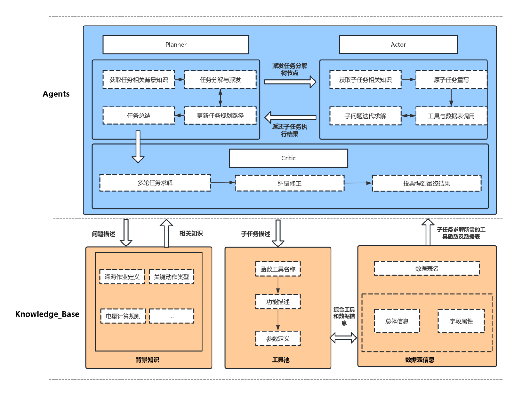

# 清竞

### 一、团队信息

- 赛事名称：GLM 深远海船舶作业大模型应用赛
- 队伍编号：5ed89b27e7b84c47b6196611d6f20753
- 队伍名称：试试又不会怎样
- 团队成员：刘泉昕、徐瑞达、钟健维

### 二、项目介绍及框架图

#### 2.1 项目介绍
本项目是在深远海船舶作业场景下开发的基于LLM的多智能体系统，主要由三大模块构成：
- 多角色智能体协同框架
- 领域专家知识库
- 面向数据科学的工具池

#### 2.2 框架图


### 三、环境准备

#### 3.1 环境要求

- Python 版本：3.11.11
- Jupter 版本：
  - IPython : 8.30.0
  - ipykernel : 6.29.5
  - jupyter_client : 8.6.3
  - jupyter_core : 5.7.2
  - traitlets : 5.14.3

#### 3.2 安装依赖

- 安装 Python 相关依赖：
  ```sh
  pip install -r devlop_home/requirements.txt
  ```
- 环境变量：设置 GLM 的 API KEY，环境变量名为`ZHIPUAI_API_KEY`
  - Linux/MacOS
  ```bash
  export ZHIPUAI_API_KEY=your_api_key
  echo $ZHIPUAI_API_KEY
  ```
  - Windows
  ```cmd
  set ZHIPUAI_API_KEY=your_api_key
  echo %ZHIPUAI_API_KEY%
  ```
- 数据集：将数据集放置在`devlop_home/复赛b榜数据`文件夹下

### 四、运行

#### 4.1 批处理脚本（推荐）

- 运行`run.bat`，将自动完成数据预处理、问题回答、结果输出等操作

#### 4.2 手动运行

1. 生成`devlop_home/data_process.py`文件：

```sh
jupyter nbconvert --to script devlop_home/data_process.ipynb
```

2. 运行`devlop_home/data_process.py`文件，预处理数据集至`devlop_home/data`文件夹：

```sh
python devlop_home/data_process.py
```

3. 运行`devlop_home/main.py`文件，依次回答问题，得到结果：

```sh
python devlop_home/main.py .\devlop_data\input_param.json .\devlop_result\answer.jsonl
```

4. 修改相关配置：查看`devlop_home/config.json`文件

#### 4.3 Demo

#### 五、目录结构

```plaintext
devlop_home目录结构
│  config.json            # 配置文件
│  data_process.ipynb     # 数据预处理 Jupyter Notebook
│  data_process.py        # 数据预处理 Python 文件
│  knowledge.py           # 知识库管理
│  llm.py                 # LLM API管理
│  logger.py              # 日志
│  main.py                # 主函数
│  requirements.txt       # Python依赖
│  run.py                 # 主函数（本地调试）
│  schema.py              # Model定义
│  utils.py               # 工具
│
├─agent                   # Agent池
│  │  actor.py            # ActorAgent
│  │  base.py             # BaseAgent
│  │  critic.py           # CriticAgent
│  │  planner.py          # PlannerAgent
│  │  start.py            # 单个问题处理入口
│  └─ __init__.py
│
│
├─knowledge               # 知识库
│  │  knowledge.json      # 基于交互轨迹生成的经验知识
│  └─ table_meta.json     # 数据表结构
│
├─manual
│  │  actions.json        # LLM标注的关键动作
│  └─ stages.json         # LLM标注的关键阶段
│
├─prompt                  # Prompt
│  │  actor.py            # ActorAgent相关指令
│  │  critic.py           # CriticAgent相关指令
│  │  planner.py          # PlannerAgent相关指令
│  │  preflight.py        # 预检请求相关指令
│  │  summary.py          # 总结相关指令
│  │  vote.py             # 投票相关指令
│  └─ __init__.py
│
├─tool                                    # 工具池
│  │  base.py                             # BaseTool
│  │  before_or_late_ratio_calculator.py
│  │  data_aggregator.py
│  │  data_filter.py
│  │  deepsea_operation_counter.py
│  │  device_param_detail_queryer.py
│  │  duration_calculator.py
│  │  energy_usage_calculator.py
│  │  key_action_retriever.py
│  │  math_calculator.py
│  │  power_fuel_calculator.py
│  │  python_code_generator.py
│  │  saling_stage_queryer.py
│  │  time_converter.py
│  │  time_sorter.py
│  │  tool_collection.py                  # 工具集合
│  │  tool_pool.py                        # 工具池
│  └─ __init__.py
│
└─ data、复赛b榜数据                        # 预处理后数据
```
